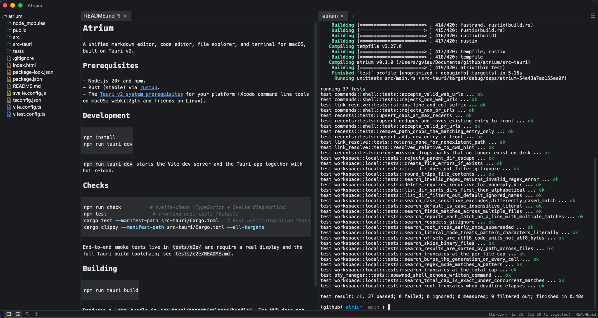

# Atrium



A unified markdown editor, code editor, file explorer, and terminal for macOS, built on Tauri v2.

## Prerequisites

- Node.js 20+ and npm.
- Rust (stable) via [rustup](https://rustup.rs).
- The [Tauri v2 system prerequisites](https://v2.tauri.app/start/prerequisites/) for your platform (Xcode command line tools on macOS; webkit2gtk and friends on Linux).

## Development

```sh
npm install
npm run tauri dev
```

`npm run tauri dev` starts the Vite dev server and the Tauri app together with hot reload.

## Checks

```sh
npm run check          # svelte-check (TypeScript + Svelte diagnostics)
npm test                # frontend unit tests (Vitest)
cargo test --manifest-path src-tauri/Cargo.toml   # Rust unit/integration tests
cargo clippy --manifest-path src-tauri/Cargo.toml --all-targets
```

End-to-end smoke tests live in `tests/e2e/` and require a real display and the full Tauri build toolchain; see `tests/e2e/README.md`.

## Building

```sh
npm run tauri build
```

Produces a `.app` bundle in `src-tauri/target/release/bundle/`. The MVP does not require Developer ID signing or notarization — local/ad-hoc signing (or an unsigned build with a manually-cleared Gatekeeper warning) is sufficient.
