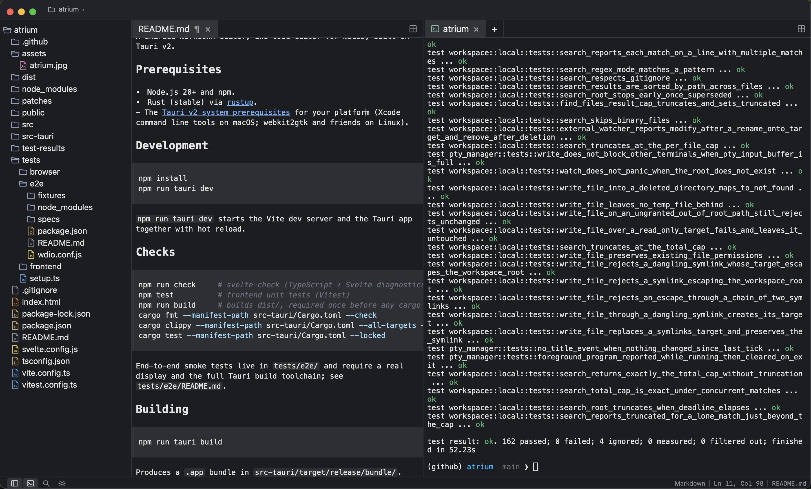

# Atrium

A unified markdown and code editor for macOS.



## Why?

Agentic development has made markdown a first-class artifact for engineers: specs, plans, notes, whatever your agents hand back. Reading raw markdown is a terrible experience. Other editors have a preview mode, but you can't edit the rendered view, so you switch back and forth all day. Tools like Obsidian get the reading right but lack the rest of the features developers need, forcing you to juggle multiple apps.

Not to mention how modern IDEs try to shove native AI features down your throat when all most people need is a terminal so they can use whatever tools suit them best.

Atrium fixes all that by combining a rendered markdown editor with an IDE. All the tools you need with none that you don't.

## Key Features

- **Editable rendered markdown.** No preview pane, no switching.
- **A real code editor.** Syntax highlighting, search, split panes.
- **Clickable file paths in terminal output.** `spec.md:42` opens right there, so agent output is one click away.

## Prerequisites

- Node.js 20+ and npm.
- Rust (stable) via [rustup](https://rustup.rs).
- The [Tauri v2 system prerequisites](https://v2.tauri.app/start/prerequisites/) for your platform (Xcode Command Line Tools on macOS; webkit2gtk and friends on Linux).

## Development

```sh
npm install
npm run tauri dev
```

`npm run tauri dev` starts the Vite dev server and the Tauri app together with hot reload.

## Checks

```sh
npm run check     # svelte-check (TypeScript + Svelte diagnostics), fails on warnings
npm test          # frontend unit tests (Vitest)
npm run build     # builds dist/, required once before any cargo command below
cargo fmt --manifest-path src-tauri/Cargo.toml --check                                   # Rust formatting
cargo clippy --manifest-path src-tauri/Cargo.toml --all-targets --locked -- -D warnings  # Rust lints, fails on warnings
cargo test --manifest-path src-tauri/Cargo.toml --locked                                 # Rust unit/integration tests
```

End-to-end smoke tests live in `tests/e2e/` and require a real display and the full Tauri build toolchain; see `tests/e2e/README.md`.

## Building

```sh
npm run tauri build
```

Produces a `.app` bundle in `src-tauri/target/release/bundle/`. The MVP does not require Developer ID signing or notarization; local/ad-hoc signing (or an unsigned build with a manually cleared Gatekeeper warning) is sufficient.
