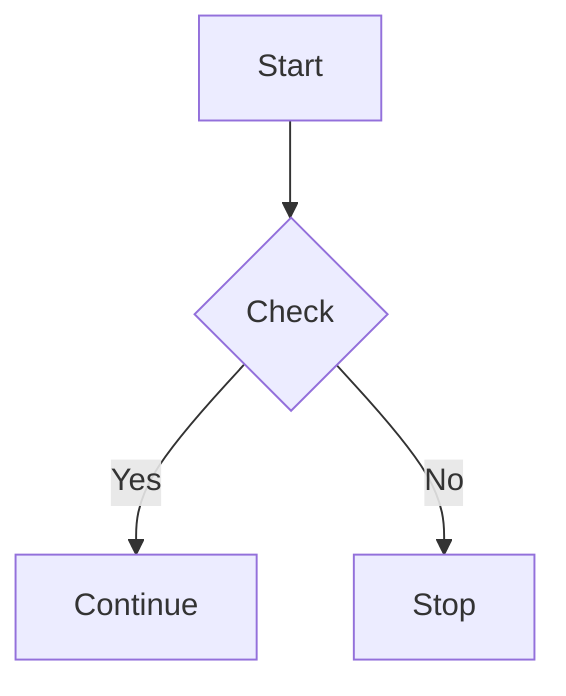
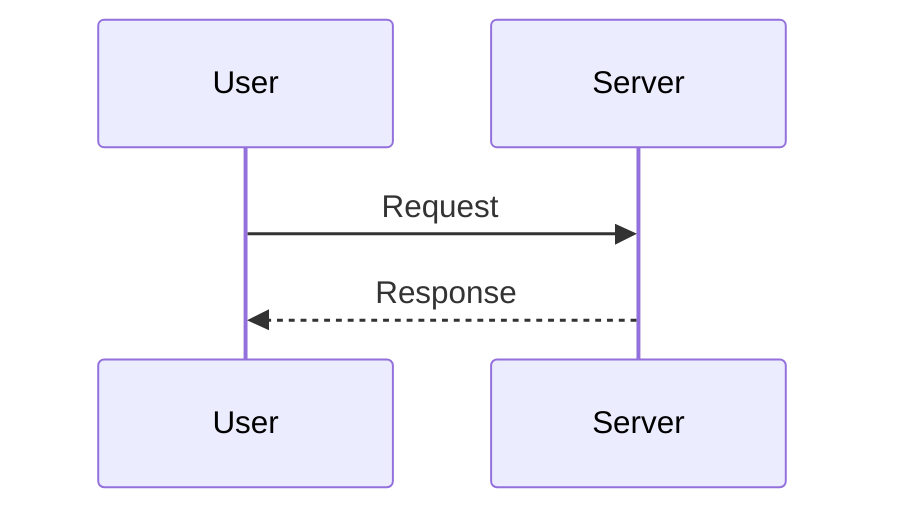
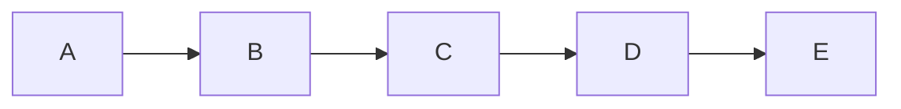
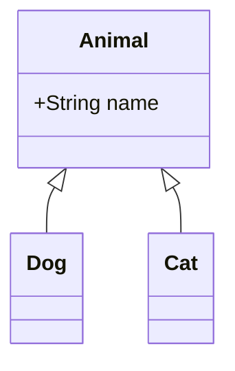
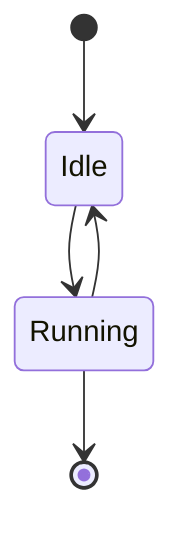

# Scroll jump repro fixture (issue #311)

Large, media-heavy document used by `scrollJump.e2e.js` to reproduce issue #311: rendered-markdown scroll
jumping back up while the user scrolls down. Mirrors the reporter's description of a large file mixing
images, tables, and Mermaid diagrams throughout.

## Section 1

This is paragraph 1 of a long, media-heavy document used to reproduce issue #311. It scrolls through prose, images, tables, and Mermaid diagrams so background parsing and asynchronous widget rendering keep happening throughout the whole scroll gesture, not just near the top of the file.

## Section 2

This is paragraph 2 of a long, media-heavy document used to reproduce issue #311. It scrolls through prose, images, tables, and Mermaid diagrams so background parsing and asynchronous widget rendering keep happening throughout the whole scroll gesture, not just near the top of the file.

## Section 3

This is paragraph 3 of a long, media-heavy document used to reproduce issue #311. It scrolls through prose, images, tables, and Mermaid diagrams so background parsing and asynchronous widget rendering keep happening throughout the whole scroll gesture, not just near the top of the file.

## Section 4

This is paragraph 4 of a long, media-heavy document used to reproduce issue #311. It scrolls through prose, images, tables, and Mermaid diagrams so background parsing and asynchronous widget rendering keep happening throughout the whole scroll gesture, not just near the top of the file.

## Section 5

This is paragraph 5 of a long, media-heavy document used to reproduce issue #311. It scrolls through prose, images, tables, and Mermaid diagrams so background parsing and asynchronous widget rendering keep happening throughout the whole scroll gesture, not just near the top of the file.

## Section 6

This is paragraph 6 of a long, media-heavy document used to reproduce issue #311. It scrolls through prose, images, tables, and Mermaid diagrams so background parsing and asynchronous widget rendering keep happening throughout the whole scroll gesture, not just near the top of the file.

## Section 7

This is paragraph 7 of a long, media-heavy document used to reproduce issue #311. It scrolls through prose, images, tables, and Mermaid diagrams so background parsing and asynchronous widget rendering keep happening throughout the whole scroll gesture, not just near the top of the file.

## Section 8

This is paragraph 8 of a long, media-heavy document used to reproduce issue #311. It scrolls through prose, images, tables, and Mermaid diagrams so background parsing and asynchronous widget rendering keep happening throughout the whole scroll gesture, not just near the top of the file.

## Section 9

This is paragraph 9 of a long, media-heavy document used to reproduce issue #311. It scrolls through prose, images, tables, and Mermaid diagrams so background parsing and asynchronous widget rendering keep happening throughout the whole scroll gesture, not just near the top of the file.

## Section 10

This is paragraph 10 of a long, media-heavy document used to reproduce issue #311. It scrolls through prose, images, tables, and Mermaid diagrams so background parsing and asynchronous widget rendering keep happening throughout the whole scroll gesture, not just near the top of the file.

## Section 11

This is paragraph 11 of a long, media-heavy document used to reproduce issue #311. It scrolls through prose, images, tables, and Mermaid diagrams so background parsing and asynchronous widget rendering keep happening throughout the whole scroll gesture, not just near the top of the file.

| Column A | Column B | Column C |
| -------- | -------- | -------- |
| row 11-1a | row 11-1b | row 11-1c |
| row 11-2a | row 11-2b | row 11-2c |
| row 11-3a | row 11-3b | row 11-3c |

## Section 12

This is paragraph 12 of a long, media-heavy document used to reproduce issue #311. It scrolls through prose, images, tables, and Mermaid diagrams so background parsing and asynchronous widget rendering keep happening throughout the whole scroll gesture, not just near the top of the file.

## Section 13

This is paragraph 13 of a long, media-heavy document used to reproduce issue #311. It scrolls through prose, images, tables, and Mermaid diagrams so background parsing and asynchronous widget rendering keep happening throughout the whole scroll gesture, not just near the top of the file.

## Section 14

This is paragraph 14 of a long, media-heavy document used to reproduce issue #311. It scrolls through prose, images, tables, and Mermaid diagrams so background parsing and asynchronous widget rendering keep happening throughout the whole scroll gesture, not just near the top of the file.

## Section 15

This is paragraph 15 of a long, media-heavy document used to reproduce issue #311. It scrolls through prose, images, tables, and Mermaid diagrams so background parsing and asynchronous widget rendering keep happening throughout the whole scroll gesture, not just near the top of the file.

## Section 16

This is paragraph 16 of a long, media-heavy document used to reproduce issue #311. It scrolls through prose, images, tables, and Mermaid diagrams so background parsing and asynchronous widget rendering keep happening throughout the whole scroll gesture, not just near the top of the file.

## Section 17

This is paragraph 17 of a long, media-heavy document used to reproduce issue #311. It scrolls through prose, images, tables, and Mermaid diagrams so background parsing and asynchronous widget rendering keep happening throughout the whole scroll gesture, not just near the top of the file.

## Section 18

This is paragraph 18 of a long, media-heavy document used to reproduce issue #311. It scrolls through prose, images, tables, and Mermaid diagrams so background parsing and asynchronous widget rendering keep happening throughout the whole scroll gesture, not just near the top of the file.

## Section 19

This is paragraph 19 of a long, media-heavy document used to reproduce issue #311. It scrolls through prose, images, tables, and Mermaid diagrams so background parsing and asynchronous widget rendering keep happening throughout the whole scroll gesture, not just near the top of the file.

## Section 20

This is paragraph 20 of a long, media-heavy document used to reproduce issue #311. It scrolls through prose, images, tables, and Mermaid diagrams so background parsing and asynchronous widget rendering keep happening throughout the whole scroll gesture, not just near the top of the file.

## Section 21

This is paragraph 21 of a long, media-heavy document used to reproduce issue #311. It scrolls through prose, images, tables, and Mermaid diagrams so background parsing and asynchronous widget rendering keep happening throughout the whole scroll gesture, not just near the top of the file.

## Section 22

This is paragraph 22 of a long, media-heavy document used to reproduce issue #311. It scrolls through prose, images, tables, and Mermaid diagrams so background parsing and asynchronous widget rendering keep happening throughout the whole scroll gesture, not just near the top of the file.

| Column A | Column B | Column C |
| -------- | -------- | -------- |
| row 22-1a | row 22-1b | row 22-1c |
| row 22-2a | row 22-2b | row 22-2c |
| row 22-3a | row 22-3b | row 22-3c |

## Section 23

This is paragraph 23 of a long, media-heavy document used to reproduce issue #311. It scrolls through prose, images, tables, and Mermaid diagrams so background parsing and asynchronous widget rendering keep happening throughout the whole scroll gesture, not just near the top of the file.

## Section 24

This is paragraph 24 of a long, media-heavy document used to reproduce issue #311. It scrolls through prose, images, tables, and Mermaid diagrams so background parsing and asynchronous widget rendering keep happening throughout the whole scroll gesture, not just near the top of the file.

## Section 25

This is paragraph 25 of a long, media-heavy document used to reproduce issue #311. It scrolls through prose, images, tables, and Mermaid diagrams so background parsing and asynchronous widget rendering keep happening throughout the whole scroll gesture, not just near the top of the file.

## Section 26

This is paragraph 26 of a long, media-heavy document used to reproduce issue #311. It scrolls through prose, images, tables, and Mermaid diagrams so background parsing and asynchronous widget rendering keep happening throughout the whole scroll gesture, not just near the top of the file.

## Section 27

This is paragraph 27 of a long, media-heavy document used to reproduce issue #311. It scrolls through prose, images, tables, and Mermaid diagrams so background parsing and asynchronous widget rendering keep happening throughout the whole scroll gesture, not just near the top of the file.

## Section 28

This is paragraph 28 of a long, media-heavy document used to reproduce issue #311. It scrolls through prose, images, tables, and Mermaid diagrams so background parsing and asynchronous widget rendering keep happening throughout the whole scroll gesture, not just near the top of the file.

## Section 29

This is paragraph 29 of a long, media-heavy document used to reproduce issue #311. It scrolls through prose, images, tables, and Mermaid diagrams so background parsing and asynchronous widget rendering keep happening throughout the whole scroll gesture, not just near the top of the file.

## Section 30

This is paragraph 30 of a long, media-heavy document used to reproduce issue #311. It scrolls through prose, images, tables, and Mermaid diagrams so background parsing and asynchronous widget rendering keep happening throughout the whole scroll gesture, not just near the top of the file.

## Section 31

This is paragraph 31 of a long, media-heavy document used to reproduce issue #311. It scrolls through prose, images, tables, and Mermaid diagrams so background parsing and asynchronous widget rendering keep happening throughout the whole scroll gesture, not just near the top of the file.

## Section 32

This is paragraph 32 of a long, media-heavy document used to reproduce issue #311. It scrolls through prose, images, tables, and Mermaid diagrams so background parsing and asynchronous widget rendering keep happening throughout the whole scroll gesture, not just near the top of the file.

## Section 33

This is paragraph 33 of a long, media-heavy document used to reproduce issue #311. It scrolls through prose, images, tables, and Mermaid diagrams so background parsing and asynchronous widget rendering keep happening throughout the whole scroll gesture, not just near the top of the file.

| Column A | Column B | Column C |
| -------- | -------- | -------- |
| row 33-1a | row 33-1b | row 33-1c |
| row 33-2a | row 33-2b | row 33-2c |
| row 33-3a | row 33-3b | row 33-3c |

## Section 34

This is paragraph 34 of a long, media-heavy document used to reproduce issue #311. It scrolls through prose, images, tables, and Mermaid diagrams so background parsing and asynchronous widget rendering keep happening throughout the whole scroll gesture, not just near the top of the file.

## Section 35

This is paragraph 35 of a long, media-heavy document used to reproduce issue #311. It scrolls through prose, images, tables, and Mermaid diagrams so background parsing and asynchronous widget rendering keep happening throughout the whole scroll gesture, not just near the top of the file.

## Section 36

This is paragraph 36 of a long, media-heavy document used to reproduce issue #311. It scrolls through prose, images, tables, and Mermaid diagrams so background parsing and asynchronous widget rendering keep happening throughout the whole scroll gesture, not just near the top of the file.

## Section 37

This is paragraph 37 of a long, media-heavy document used to reproduce issue #311. It scrolls through prose, images, tables, and Mermaid diagrams so background parsing and asynchronous widget rendering keep happening throughout the whole scroll gesture, not just near the top of the file.

## Section 38

This is paragraph 38 of a long, media-heavy document used to reproduce issue #311. It scrolls through prose, images, tables, and Mermaid diagrams so background parsing and asynchronous widget rendering keep happening throughout the whole scroll gesture, not just near the top of the file.

## Section 39

This is paragraph 39 of a long, media-heavy document used to reproduce issue #311. It scrolls through prose, images, tables, and Mermaid diagrams so background parsing and asynchronous widget rendering keep happening throughout the whole scroll gesture, not just near the top of the file.

## Section 40

This is paragraph 40 of a long, media-heavy document used to reproduce issue #311. It scrolls through prose, images, tables, and Mermaid diagrams so background parsing and asynchronous widget rendering keep happening throughout the whole scroll gesture, not just near the top of the file.

## Section 41

This is paragraph 41 of a long, media-heavy document used to reproduce issue #311. It scrolls through prose, images, tables, and Mermaid diagrams so background parsing and asynchronous widget rendering keep happening throughout the whole scroll gesture, not just near the top of the file.

## Section 42

This is paragraph 42 of a long, media-heavy document used to reproduce issue #311. It scrolls through prose, images, tables, and Mermaid diagrams so background parsing and asynchronous widget rendering keep happening throughout the whole scroll gesture, not just near the top of the file.

## Section 43

This is paragraph 43 of a long, media-heavy document used to reproduce issue #311. It scrolls through prose, images, tables, and Mermaid diagrams so background parsing and asynchronous widget rendering keep happening throughout the whole scroll gesture, not just near the top of the file.

## Section 44

This is paragraph 44 of a long, media-heavy document used to reproduce issue #311. It scrolls through prose, images, tables, and Mermaid diagrams so background parsing and asynchronous widget rendering keep happening throughout the whole scroll gesture, not just near the top of the file.

| Column A | Column B | Column C |
| -------- | -------- | -------- |
| row 44-1a | row 44-1b | row 44-1c |
| row 44-2a | row 44-2b | row 44-2c |
| row 44-3a | row 44-3b | row 44-3c |

## Section 45

This is paragraph 45 of a long, media-heavy document used to reproduce issue #311. It scrolls through prose, images, tables, and Mermaid diagrams so background parsing and asynchronous widget rendering keep happening throughout the whole scroll gesture, not just near the top of the file.

## Section 46

This is paragraph 46 of a long, media-heavy document used to reproduce issue #311. It scrolls through prose, images, tables, and Mermaid diagrams so background parsing and asynchronous widget rendering keep happening throughout the whole scroll gesture, not just near the top of the file.

## Section 47

This is paragraph 47 of a long, media-heavy document used to reproduce issue #311. It scrolls through prose, images, tables, and Mermaid diagrams so background parsing and asynchronous widget rendering keep happening throughout the whole scroll gesture, not just near the top of the file.

## Section 48

This is paragraph 48 of a long, media-heavy document used to reproduce issue #311. It scrolls through prose, images, tables, and Mermaid diagrams so background parsing and asynchronous widget rendering keep happening throughout the whole scroll gesture, not just near the top of the file.

## Section 49

This is paragraph 49 of a long, media-heavy document used to reproduce issue #311. It scrolls through prose, images, tables, and Mermaid diagrams so background parsing and asynchronous widget rendering keep happening throughout the whole scroll gesture, not just near the top of the file.

## Section 50

This is paragraph 50 of a long, media-heavy document used to reproduce issue #311. It scrolls through prose, images, tables, and Mermaid diagrams so background parsing and asynchronous widget rendering keep happening throughout the whole scroll gesture, not just near the top of the file.

## Section 51

This is paragraph 51 of a long, media-heavy document used to reproduce issue #311. It scrolls through prose, images, tables, and Mermaid diagrams so background parsing and asynchronous widget rendering keep happening throughout the whole scroll gesture, not just near the top of the file.

## Section 52

This is paragraph 52 of a long, media-heavy document used to reproduce issue #311. It scrolls through prose, images, tables, and Mermaid diagrams so background parsing and asynchronous widget rendering keep happening throughout the whole scroll gesture, not just near the top of the file.

## Section 53

This is paragraph 53 of a long, media-heavy document used to reproduce issue #311. It scrolls through prose, images, tables, and Mermaid diagrams so background parsing and asynchronous widget rendering keep happening throughout the whole scroll gesture, not just near the top of the file.

## Section 54

This is paragraph 54 of a long, media-heavy document used to reproduce issue #311. It scrolls through prose, images, tables, and Mermaid diagrams so background parsing and asynchronous widget rendering keep happening throughout the whole scroll gesture, not just near the top of the file.

## Section 55

This is paragraph 55 of a long, media-heavy document used to reproduce issue #311. It scrolls through prose, images, tables, and Mermaid diagrams so background parsing and asynchronous widget rendering keep happening throughout the whole scroll gesture, not just near the top of the file.

| Column A | Column B | Column C |
| -------- | -------- | -------- |
| row 55-1a | row 55-1b | row 55-1c |
| row 55-2a | row 55-2b | row 55-2c |
| row 55-3a | row 55-3b | row 55-3c |

## Section 56

This is paragraph 56 of a long, media-heavy document used to reproduce issue #311. It scrolls through prose, images, tables, and Mermaid diagrams so background parsing and asynchronous widget rendering keep happening throughout the whole scroll gesture, not just near the top of the file.

## Section 57

This is paragraph 57 of a long, media-heavy document used to reproduce issue #311. It scrolls through prose, images, tables, and Mermaid diagrams so background parsing and asynchronous widget rendering keep happening throughout the whole scroll gesture, not just near the top of the file.

## Section 58

This is paragraph 58 of a long, media-heavy document used to reproduce issue #311. It scrolls through prose, images, tables, and Mermaid diagrams so background parsing and asynchronous widget rendering keep happening throughout the whole scroll gesture, not just near the top of the file.

## Section 59

This is paragraph 59 of a long, media-heavy document used to reproduce issue #311. It scrolls through prose, images, tables, and Mermaid diagrams so background parsing and asynchronous widget rendering keep happening throughout the whole scroll gesture, not just near the top of the file.

## Section 60

This is paragraph 60 of a long, media-heavy document used to reproduce issue #311. It scrolls through prose, images, tables, and Mermaid diagrams so background parsing and asynchronous widget rendering keep happening throughout the whole scroll gesture, not just near the top of the file.

## Section 61

This is paragraph 61 of a long, media-heavy document used to reproduce issue #311. It scrolls through prose, images, tables, and Mermaid diagrams so background parsing and asynchronous widget rendering keep happening throughout the whole scroll gesture, not just near the top of the file.

## Section 62

This is paragraph 62 of a long, media-heavy document used to reproduce issue #311. It scrolls through prose, images, tables, and Mermaid diagrams so background parsing and asynchronous widget rendering keep happening throughout the whole scroll gesture, not just near the top of the file.

## Section 63

This is paragraph 63 of a long, media-heavy document used to reproduce issue #311. It scrolls through prose, images, tables, and Mermaid diagrams so background parsing and asynchronous widget rendering keep happening throughout the whole scroll gesture, not just near the top of the file.

## Section 64

This is paragraph 64 of a long, media-heavy document used to reproduce issue #311. It scrolls through prose, images, tables, and Mermaid diagrams so background parsing and asynchronous widget rendering keep happening throughout the whole scroll gesture, not just near the top of the file.

## Section 65

This is paragraph 65 of a long, media-heavy document used to reproduce issue #311. It scrolls through prose, images, tables, and Mermaid diagrams so background parsing and asynchronous widget rendering keep happening throughout the whole scroll gesture, not just near the top of the file.

## Section 66

This is paragraph 66 of a long, media-heavy document used to reproduce issue #311. It scrolls through prose, images, tables, and Mermaid diagrams so background parsing and asynchronous widget rendering keep happening throughout the whole scroll gesture, not just near the top of the file.

| Column A | Column B | Column C |
| -------- | -------- | -------- |
| row 66-1a | row 66-1b | row 66-1c |
| row 66-2a | row 66-2b | row 66-2c |
| row 66-3a | row 66-3b | row 66-3c |

## Section 67

This is paragraph 67 of a long, media-heavy document used to reproduce issue #311. It scrolls through prose, images, tables, and Mermaid diagrams so background parsing and asynchronous widget rendering keep happening throughout the whole scroll gesture, not just near the top of the file.

## Section 68

This is paragraph 68 of a long, media-heavy document used to reproduce issue #311. It scrolls through prose, images, tables, and Mermaid diagrams so background parsing and asynchronous widget rendering keep happening throughout the whole scroll gesture, not just near the top of the file.

## Section 69

This is paragraph 69 of a long, media-heavy document used to reproduce issue #311. It scrolls through prose, images, tables, and Mermaid diagrams so background parsing and asynchronous widget rendering keep happening throughout the whole scroll gesture, not just near the top of the file.

## Section 70

This is paragraph 70 of a long, media-heavy document used to reproduce issue #311. It scrolls through prose, images, tables, and Mermaid diagrams so background parsing and asynchronous widget rendering keep happening throughout the whole scroll gesture, not just near the top of the file.

## Section 71

This is paragraph 71 of a long, media-heavy document used to reproduce issue #311. It scrolls through prose, images, tables, and Mermaid diagrams so background parsing and asynchronous widget rendering keep happening throughout the whole scroll gesture, not just near the top of the file.

## Section 72

This is paragraph 72 of a long, media-heavy document used to reproduce issue #311. It scrolls through prose, images, tables, and Mermaid diagrams so background parsing and asynchronous widget rendering keep happening throughout the whole scroll gesture, not just near the top of the file.

## Section 73

This is paragraph 73 of a long, media-heavy document used to reproduce issue #311. It scrolls through prose, images, tables, and Mermaid diagrams so background parsing and asynchronous widget rendering keep happening throughout the whole scroll gesture, not just near the top of the file.

## Section 74

This is paragraph 74 of a long, media-heavy document used to reproduce issue #311. It scrolls through prose, images, tables, and Mermaid diagrams so background parsing and asynchronous widget rendering keep happening throughout the whole scroll gesture, not just near the top of the file.

## Section 75

This is paragraph 75 of a long, media-heavy document used to reproduce issue #311. It scrolls through prose, images, tables, and Mermaid diagrams so background parsing and asynchronous widget rendering keep happening throughout the whole scroll gesture, not just near the top of the file.

## Section 76

This is paragraph 76 of a long, media-heavy document used to reproduce issue #311. It scrolls through prose, images, tables, and Mermaid diagrams so background parsing and asynchronous widget rendering keep happening throughout the whole scroll gesture, not just near the top of the file.

## Section 77

This is paragraph 77 of a long, media-heavy document used to reproduce issue #311. It scrolls through prose, images, tables, and Mermaid diagrams so background parsing and asynchronous widget rendering keep happening throughout the whole scroll gesture, not just near the top of the file.

| Column A | Column B | Column C |
| -------- | -------- | -------- |
| row 77-1a | row 77-1b | row 77-1c |
| row 77-2a | row 77-2b | row 77-2c |
| row 77-3a | row 77-3b | row 77-3c |

## Section 78

This is paragraph 78 of a long, media-heavy document used to reproduce issue #311. It scrolls through prose, images, tables, and Mermaid diagrams so background parsing and asynchronous widget rendering keep happening throughout the whole scroll gesture, not just near the top of the file.

## Section 79

This is paragraph 79 of a long, media-heavy document used to reproduce issue #311. It scrolls through prose, images, tables, and Mermaid diagrams so background parsing and asynchronous widget rendering keep happening throughout the whole scroll gesture, not just near the top of the file.

## Section 80

This is paragraph 80 of a long, media-heavy document used to reproduce issue #311. It scrolls through prose, images, tables, and Mermaid diagrams so background parsing and asynchronous widget rendering keep happening throughout the whole scroll gesture, not just near the top of the file.

## Section 81

This is paragraph 81 of a long, media-heavy document used to reproduce issue #311. It scrolls through prose, images, tables, and Mermaid diagrams so background parsing and asynchronous widget rendering keep happening throughout the whole scroll gesture, not just near the top of the file.

## Section 82

This is paragraph 82 of a long, media-heavy document used to reproduce issue #311. It scrolls through prose, images, tables, and Mermaid diagrams so background parsing and asynchronous widget rendering keep happening throughout the whole scroll gesture, not just near the top of the file.

## Section 83

This is paragraph 83 of a long, media-heavy document used to reproduce issue #311. It scrolls through prose, images, tables, and Mermaid diagrams so background parsing and asynchronous widget rendering keep happening throughout the whole scroll gesture, not just near the top of the file.

## Section 84

This is paragraph 84 of a long, media-heavy document used to reproduce issue #311. It scrolls through prose, images, tables, and Mermaid diagrams so background parsing and asynchronous widget rendering keep happening throughout the whole scroll gesture, not just near the top of the file.

## Section 85

This is paragraph 85 of a long, media-heavy document used to reproduce issue #311. It scrolls through prose, images, tables, and Mermaid diagrams so background parsing and asynchronous widget rendering keep happening throughout the whole scroll gesture, not just near the top of the file.

## Section 86

This is paragraph 86 of a long, media-heavy document used to reproduce issue #311. It scrolls through prose, images, tables, and Mermaid diagrams so background parsing and asynchronous widget rendering keep happening throughout the whole scroll gesture, not just near the top of the file.

## Section 87

This is paragraph 87 of a long, media-heavy document used to reproduce issue #311. It scrolls through prose, images, tables, and Mermaid diagrams so background parsing and asynchronous widget rendering keep happening throughout the whole scroll gesture, not just near the top of the file.

## Section 88

This is paragraph 88 of a long, media-heavy document used to reproduce issue #311. It scrolls through prose, images, tables, and Mermaid diagrams so background parsing and asynchronous widget rendering keep happening throughout the whole scroll gesture, not just near the top of the file.

| Column A | Column B | Column C |
| -------- | -------- | -------- |
| row 88-1a | row 88-1b | row 88-1c |
| row 88-2a | row 88-2b | row 88-2c |
| row 88-3a | row 88-3b | row 88-3c |

## Section 89

This is paragraph 89 of a long, media-heavy document used to reproduce issue #311. It scrolls through prose, images, tables, and Mermaid diagrams so background parsing and asynchronous widget rendering keep happening throughout the whole scroll gesture, not just near the top of the file.

## Section 90

This is paragraph 90 of a long, media-heavy document used to reproduce issue #311. It scrolls through prose, images, tables, and Mermaid diagrams so background parsing and asynchronous widget rendering keep happening throughout the whole scroll gesture, not just near the top of the file.

## Section 91

This is paragraph 91 of a long, media-heavy document used to reproduce issue #311. It scrolls through prose, images, tables, and Mermaid diagrams so background parsing and asynchronous widget rendering keep happening throughout the whole scroll gesture, not just near the top of the file.

## Section 92

This is paragraph 92 of a long, media-heavy document used to reproduce issue #311. It scrolls through prose, images, tables, and Mermaid diagrams so background parsing and asynchronous widget rendering keep happening throughout the whole scroll gesture, not just near the top of the file.

## Section 93

This is paragraph 93 of a long, media-heavy document used to reproduce issue #311. It scrolls through prose, images, tables, and Mermaid diagrams so background parsing and asynchronous widget rendering keep happening throughout the whole scroll gesture, not just near the top of the file.

## Section 94

This is paragraph 94 of a long, media-heavy document used to reproduce issue #311. It scrolls through prose, images, tables, and Mermaid diagrams so background parsing and asynchronous widget rendering keep happening throughout the whole scroll gesture, not just near the top of the file.

## Section 95

This is paragraph 95 of a long, media-heavy document used to reproduce issue #311. It scrolls through prose, images, tables, and Mermaid diagrams so background parsing and asynchronous widget rendering keep happening throughout the whole scroll gesture, not just near the top of the file.

## Section 96

This is paragraph 96 of a long, media-heavy document used to reproduce issue #311. It scrolls through prose, images, tables, and Mermaid diagrams so background parsing and asynchronous widget rendering keep happening throughout the whole scroll gesture, not just near the top of the file.

## Section 97

This is paragraph 97 of a long, media-heavy document used to reproduce issue #311. It scrolls through prose, images, tables, and Mermaid diagrams so background parsing and asynchronous widget rendering keep happening throughout the whole scroll gesture, not just near the top of the file.

## Section 98

This is paragraph 98 of a long, media-heavy document used to reproduce issue #311. It scrolls through prose, images, tables, and Mermaid diagrams so background parsing and asynchronous widget rendering keep happening throughout the whole scroll gesture, not just near the top of the file.

## Section 99

This is paragraph 99 of a long, media-heavy document used to reproduce issue #311. It scrolls through prose, images, tables, and Mermaid diagrams so background parsing and asynchronous widget rendering keep happening throughout the whole scroll gesture, not just near the top of the file.

| Column A | Column B | Column C |
| -------- | -------- | -------- |
| row 99-1a | row 99-1b | row 99-1c |
| row 99-2a | row 99-2b | row 99-2c |
| row 99-3a | row 99-3b | row 99-3c |

## Section 100

This is paragraph 100 of a long, media-heavy document used to reproduce issue #311. It scrolls through prose, images, tables, and Mermaid diagrams so background parsing and asynchronous widget rendering keep happening throughout the whole scroll gesture, not just near the top of the file.

## Section 101

This is paragraph 101 of a long, media-heavy document used to reproduce issue #311. It scrolls through prose, images, tables, and Mermaid diagrams so background parsing and asynchronous widget rendering keep happening throughout the whole scroll gesture, not just near the top of the file.

## Section 102

This is paragraph 102 of a long, media-heavy document used to reproduce issue #311. It scrolls through prose, images, tables, and Mermaid diagrams so background parsing and asynchronous widget rendering keep happening throughout the whole scroll gesture, not just near the top of the file.

## Section 103

This is paragraph 103 of a long, media-heavy document used to reproduce issue #311. It scrolls through prose, images, tables, and Mermaid diagrams so background parsing and asynchronous widget rendering keep happening throughout the whole scroll gesture, not just near the top of the file.

## Section 104

This is paragraph 104 of a long, media-heavy document used to reproduce issue #311. It scrolls through prose, images, tables, and Mermaid diagrams so background parsing and asynchronous widget rendering keep happening throughout the whole scroll gesture, not just near the top of the file.

## Section 105

This is paragraph 105 of a long, media-heavy document used to reproduce issue #311. It scrolls through prose, images, tables, and Mermaid diagrams so background parsing and asynchronous widget rendering keep happening throughout the whole scroll gesture, not just near the top of the file.

## Section 106

This is paragraph 106 of a long, media-heavy document used to reproduce issue #311. It scrolls through prose, images, tables, and Mermaid diagrams so background parsing and asynchronous widget rendering keep happening throughout the whole scroll gesture, not just near the top of the file.

## Section 107

This is paragraph 107 of a long, media-heavy document used to reproduce issue #311. It scrolls through prose, images, tables, and Mermaid diagrams so background parsing and asynchronous widget rendering keep happening throughout the whole scroll gesture, not just near the top of the file.

## Section 108

This is paragraph 108 of a long, media-heavy document used to reproduce issue #311. It scrolls through prose, images, tables, and Mermaid diagrams so background parsing and asynchronous widget rendering keep happening throughout the whole scroll gesture, not just near the top of the file.

## Section 109

This is paragraph 109 of a long, media-heavy document used to reproduce issue #311. It scrolls through prose, images, tables, and Mermaid diagrams so background parsing and asynchronous widget rendering keep happening throughout the whole scroll gesture, not just near the top of the file.

## Section 110

This is paragraph 110 of a long, media-heavy document used to reproduce issue #311. It scrolls through prose, images, tables, and Mermaid diagrams so background parsing and asynchronous widget rendering keep happening throughout the whole scroll gesture, not just near the top of the file.

| Column A | Column B | Column C |
| -------- | -------- | -------- |
| row 110-1a | row 110-1b | row 110-1c |
| row 110-2a | row 110-2b | row 110-2c |
| row 110-3a | row 110-3b | row 110-3c |

## Section 111

This is paragraph 111 of a long, media-heavy document used to reproduce issue #311. It scrolls through prose, images, tables, and Mermaid diagrams so background parsing and asynchronous widget rendering keep happening throughout the whole scroll gesture, not just near the top of the file.

## Section 112

This is paragraph 112 of a long, media-heavy document used to reproduce issue #311. It scrolls through prose, images, tables, and Mermaid diagrams so background parsing and asynchronous widget rendering keep happening throughout the whole scroll gesture, not just near the top of the file.

## Section 113

This is paragraph 113 of a long, media-heavy document used to reproduce issue #311. It scrolls through prose, images, tables, and Mermaid diagrams so background parsing and asynchronous widget rendering keep happening throughout the whole scroll gesture, not just near the top of the file.

## Section 114

This is paragraph 114 of a long, media-heavy document used to reproduce issue #311. It scrolls through prose, images, tables, and Mermaid diagrams so background parsing and asynchronous widget rendering keep happening throughout the whole scroll gesture, not just near the top of the file.

## Section 115

This is paragraph 115 of a long, media-heavy document used to reproduce issue #311. It scrolls through prose, images, tables, and Mermaid diagrams so background parsing and asynchronous widget rendering keep happening throughout the whole scroll gesture, not just near the top of the file.

## Section 116

This is paragraph 116 of a long, media-heavy document used to reproduce issue #311. It scrolls through prose, images, tables, and Mermaid diagrams so background parsing and asynchronous widget rendering keep happening throughout the whole scroll gesture, not just near the top of the file.

## Section 117

This is paragraph 117 of a long, media-heavy document used to reproduce issue #311. It scrolls through prose, images, tables, and Mermaid diagrams so background parsing and asynchronous widget rendering keep happening throughout the whole scroll gesture, not just near the top of the file.

## Section 118

This is paragraph 118 of a long, media-heavy document used to reproduce issue #311. It scrolls through prose, images, tables, and Mermaid diagrams so background parsing and asynchronous widget rendering keep happening throughout the whole scroll gesture, not just near the top of the file.

## Section 119

This is paragraph 119 of a long, media-heavy document used to reproduce issue #311. It scrolls through prose, images, tables, and Mermaid diagrams so background parsing and asynchronous widget rendering keep happening throughout the whole scroll gesture, not just near the top of the file.

## Section 120

This is paragraph 120 of a long, media-heavy document used to reproduce issue #311. It scrolls through prose, images, tables, and Mermaid diagrams so background parsing and asynchronous widget rendering keep happening throughout the whole scroll gesture, not just near the top of the file.

## Section 121

This is paragraph 121 of a long, media-heavy document used to reproduce issue #311. It scrolls through prose, images, tables, and Mermaid diagrams so background parsing and asynchronous widget rendering keep happening throughout the whole scroll gesture, not just near the top of the file.

| Column A | Column B | Column C |
| -------- | -------- | -------- |
| row 121-1a | row 121-1b | row 121-1c |
| row 121-2a | row 121-2b | row 121-2c |
| row 121-3a | row 121-3b | row 121-3c |

## Section 122

This is paragraph 122 of a long, media-heavy document used to reproduce issue #311. It scrolls through prose, images, tables, and Mermaid diagrams so background parsing and asynchronous widget rendering keep happening throughout the whole scroll gesture, not just near the top of the file.

## Section 123

This is paragraph 123 of a long, media-heavy document used to reproduce issue #311. It scrolls through prose, images, tables, and Mermaid diagrams so background parsing and asynchronous widget rendering keep happening throughout the whole scroll gesture, not just near the top of the file.

## Section 124

This is paragraph 124 of a long, media-heavy document used to reproduce issue #311. It scrolls through prose, images, tables, and Mermaid diagrams so background parsing and asynchronous widget rendering keep happening throughout the whole scroll gesture, not just near the top of the file.

## Section 125

This is paragraph 125 of a long, media-heavy document used to reproduce issue #311. It scrolls through prose, images, tables, and Mermaid diagrams so background parsing and asynchronous widget rendering keep happening throughout the whole scroll gesture, not just near the top of the file.

## Section 126

This is paragraph 126 of a long, media-heavy document used to reproduce issue #311. It scrolls through prose, images, tables, and Mermaid diagrams so background parsing and asynchronous widget rendering keep happening throughout the whole scroll gesture, not just near the top of the file.

## Section 127

This is paragraph 127 of a long, media-heavy document used to reproduce issue #311. It scrolls through prose, images, tables, and Mermaid diagrams so background parsing and asynchronous widget rendering keep happening throughout the whole scroll gesture, not just near the top of the file.

## Section 128

This is paragraph 128 of a long, media-heavy document used to reproduce issue #311. It scrolls through prose, images, tables, and Mermaid diagrams so background parsing and asynchronous widget rendering keep happening throughout the whole scroll gesture, not just near the top of the file.

## Section 129

This is paragraph 129 of a long, media-heavy document used to reproduce issue #311. It scrolls through prose, images, tables, and Mermaid diagrams so background parsing and asynchronous widget rendering keep happening throughout the whole scroll gesture, not just near the top of the file.

## Section 130

This is paragraph 130 of a long, media-heavy document used to reproduce issue #311. It scrolls through prose, images, tables, and Mermaid diagrams so background parsing and asynchronous widget rendering keep happening throughout the whole scroll gesture, not just near the top of the file.

## Section 131

This is paragraph 131 of a long, media-heavy document used to reproduce issue #311. It scrolls through prose, images, tables, and Mermaid diagrams so background parsing and asynchronous widget rendering keep happening throughout the whole scroll gesture, not just near the top of the file.

## Section 132

This is paragraph 132 of a long, media-heavy document used to reproduce issue #311. It scrolls through prose, images, tables, and Mermaid diagrams so background parsing and asynchronous widget rendering keep happening throughout the whole scroll gesture, not just near the top of the file.

| Column A | Column B | Column C |
| -------- | -------- | -------- |
| row 132-1a | row 132-1b | row 132-1c |
| row 132-2a | row 132-2b | row 132-2c |
| row 132-3a | row 132-3b | row 132-3c |

## Section 133

This is paragraph 133 of a long, media-heavy document used to reproduce issue #311. It scrolls through prose, images, tables, and Mermaid diagrams so background parsing and asynchronous widget rendering keep happening throughout the whole scroll gesture, not just near the top of the file.

## Section 134

This is paragraph 134 of a long, media-heavy document used to reproduce issue #311. It scrolls through prose, images, tables, and Mermaid diagrams so background parsing and asynchronous widget rendering keep happening throughout the whole scroll gesture, not just near the top of the file.

## Section 135

This is paragraph 135 of a long, media-heavy document used to reproduce issue #311. It scrolls through prose, images, tables, and Mermaid diagrams so background parsing and asynchronous widget rendering keep happening throughout the whole scroll gesture, not just near the top of the file.

## Section 136

This is paragraph 136 of a long, media-heavy document used to reproduce issue #311. It scrolls through prose, images, tables, and Mermaid diagrams so background parsing and asynchronous widget rendering keep happening throughout the whole scroll gesture, not just near the top of the file.

## Section 137

This is paragraph 137 of a long, media-heavy document used to reproduce issue #311. It scrolls through prose, images, tables, and Mermaid diagrams so background parsing and asynchronous widget rendering keep happening throughout the whole scroll gesture, not just near the top of the file.

## Section 138

This is paragraph 138 of a long, media-heavy document used to reproduce issue #311. It scrolls through prose, images, tables, and Mermaid diagrams so background parsing and asynchronous widget rendering keep happening throughout the whole scroll gesture, not just near the top of the file.

## Section 139

This is paragraph 139 of a long, media-heavy document used to reproduce issue #311. It scrolls through prose, images, tables, and Mermaid diagrams so background parsing and asynchronous widget rendering keep happening throughout the whole scroll gesture, not just near the top of the file.

## Section 140

This is paragraph 140 of a long, media-heavy document used to reproduce issue #311. It scrolls through prose, images, tables, and Mermaid diagrams so background parsing and asynchronous widget rendering keep happening throughout the whole scroll gesture, not just near the top of the file.

